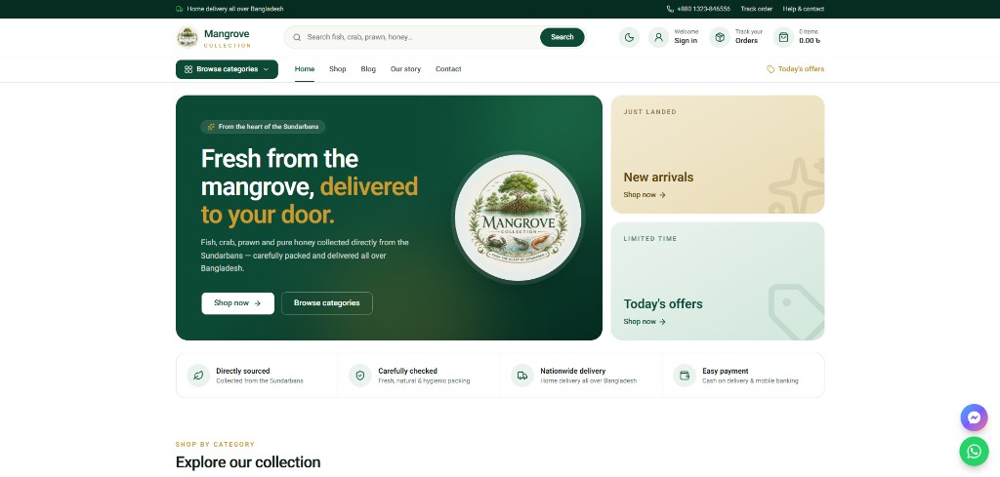

# Mangrove Collection

**Fresh from the mangrove, delivered to your door.**

Mangrove Collection is an online shop for fish, crab, prawn and pure honey collected directly from the
Sundarbans, packed carefully and delivered all over Bangladesh.

Live site: [mangrove-collection.com](https://mangrove-collection.com)



---

## Features

**Storefront** (for customers)

- Home page with hero banners, "New arrivals" and "Today's offers"
- Shop by category, product search with live suggestions, product variants and reviews
- Cart, checkout, cash on delivery and mobile banking payments (with payment proof upload)
- Customer accounts: sign in with email or Google, saved addresses, order history
- Order tracking without signing in
- Blog with categories, likes and comments, rendered at build time for SEO
- About and contact pages, newsletter signup, WhatsApp and Messenger buttons
- English and Bangla fonts (Roboto and Hind Siliguri)

**Dashboard** (for staff)

- Sales overview with charts
- Products, categories, banners, shipping methods and payment accounts
- Orders and payment review (approve or reject submitted payments)
- Customers and staff users with roles
- Blog editor, media library, comments and review moderation
- CMS pages (home, about, contact), site settings, SMTP, SMS, Google sign-in, SEO and pixel scripts

**API**

- REST API under `/v1` (storefront, account, admin and auth routes)
- Secure cookie sessions (HttpOnly, CSRF protected) shared by the storefront and the dashboard
- Rate limiting and security headers on every route

## Tech stack

| Part | Folder | Built with |
| --- | --- | --- |
| Storefront | `frontend/` | Next.js 16 (static export), React 19, Tailwind CSS 4, TanStack Query, Zustand |
| Dashboard | `dashboard/` | Vite, React 19, React Router, Tailwind CSS 4, TanStack Query, Recharts |
| API | `backend-api/` | Laravel 12, PHP 8.2+, Laravel Sanctum, MySQL 8 |

The project is a pnpm workspace. Deployment runs from GitHub Actions to cPanel hosting over FTP
(see [`.github/workflows/deploy.yml`](.github/workflows/deploy.yml)).

## Project structure

```text
mangrove-collection/
├── frontend/        # Customer storefront (Next.js) -> https://mangrove-collection.com
├── dashboard/       # Admin dashboard (Vite + React) -> https://dashboard.mangrove-collection.com
├── backend-api/     # Laravel REST API              -> https://api.mangrove-collection.com
├── .github/         # CI: test the API, build and deploy all three apps
├── DEPLOYMENT.md    # Full production setup guide (cPanel / Apache)
└── package.json     # Workspace scripts
```

## Getting started (local development)

Requirements: **Node.js 22+**, **pnpm 10**, **PHP 8.2+**, **Composer** and **MySQL 8**.

1. Install dependencies

   ```bash
   pnpm install
   cd backend-api && composer install && cd ..
   ```

2. Configure the API

   ```bash
   cd backend-api
   cp .env.example .env
   php artisan key:generate
   ```

   Edit `backend-api/.env` for local use:

   ```dotenv
   APP_URL=http://localhost:8080
   DB_DATABASE=mangrove_db
   DB_USERNAME=root
   DB_PASSWORD=
   SESSION_DOMAIN=null
   SESSION_SECURE_COOKIE=false
   SANCTUM_STATEFUL_DOMAINS=localhost:3000,localhost:5173
   CORS_ALLOWED_ORIGINS=http://localhost:3000,http://localhost:5173
   ```

3. Create the tables and seed data

   ```bash
   php artisan migrate
   php artisan db:seed                              # settings, shipping, pages, first admin
   php artisan db:seed --class=CatalogSeeder       # optional demo products
   php artisan db:seed --class=BlogSeeder          # optional demo blog posts
   php artisan storage:link
   cd ..
   ```

4. Run everything

   ```bash
   pnpm dev
   ```

   | App | URL |
   | --- | --- |
   | Storefront | http://localhost:3000 |
   | Dashboard | http://localhost:5173 |
   | API | http://localhost:8080 |

> Use `localhost` everywhere, not `127.0.0.1`. Cookies are per host, so mixing the two looks like being
> signed out.

### Useful scripts

| Command | What it does |
| --- | --- |
| `pnpm dev` | Runs the API, storefront and dashboard together |
| `pnpm dev:frontend` | Storefront only |
| `pnpm dev:dashboard` | Dashboard only |
| `pnpm api` | Laravel API only (port 8080) |
| `pnpm build` | Production build of the storefront and dashboard |
| `pnpm lint` | Lint the storefront and dashboard |
| `cd backend-api && php artisan test` | API test suite |

## Deployment

Every push to `main` runs the API tests and then deploys the API, storefront and dashboard to cPanel
via FTP. The workflow needs these GitHub repository secrets: `FTP_HOST`, `FTP_USERNAME`, `FTP_PASSWORD`,
`APP_KEY`, `DB_DATABASE`, `DB_USERNAME`, `DB_PASSWORD` (plus optional session, CORS and admin values).

The full step-by-step server setup, environment variables, security notes and troubleshooting are in
**[DEPLOYMENT.md](DEPLOYMENT.md)**.

---

## Backing up the website data

The code is safe on GitHub, and the storefront and dashboard can always be rebuilt from it. What is
**not** in Git, and must be backed up, is the live data on the server:

| What | Where (on the server) | Why it matters |
| --- | --- | --- |
| **MySQL database** | the database named in `DB_DATABASE` | Products, orders, customers, payments, blog posts, reviews, settings (including SMTP, SMS and Google keys) |
| **Uploaded images** | `~/mangrove-api/public/uploads/` | Category images, review photos |
| **Media library** | `~/mangrove-api/storage/app/public/` | Product photos, avatars, blog images and videos |
| **Environment file** | `~/mangrove-api/.env` | Database password and `APP_KEY` |

> **Keep `APP_KEY` safe.** Secret settings in the database (SMTP, SMS, Google sign-in) are encrypted
> with `APP_KEY`. A database backup restored with a different key cannot read those secrets, and all
> users get signed out. Store a copy of `.env` in a password manager, never in Git.

### Option 1: cPanel backup (easiest)

1. Log in to cPanel and open **Files > Backup** (or **Backup Wizard**).
2. Under **Download a MySQL Database Backup**, click the Mangrove database. A `.sql.gz` file downloads.
3. Under **Download a Home Directory Backup**, download the full home folder. This includes
   `mangrove-api/` with `.env`, `public/uploads/` and `storage/app/public/`.
4. Copy both files to a safe place outside the server (external drive, Google Drive, OneDrive).

Alternatively, export only the database from **phpMyAdmin**: select the database, open **Export**,
choose **Quick** and **SQL**, then click **Export**.

### Option 2: command line (cPanel Terminal or SSH)

```bash
cd ~
DATE=$(date +%F)
mkdir -p ~/backups

# 1. Database
mysqldump --single-transaction --routines --no-tablespaces \
  -u DB_USERNAME -p DB_DATABASE | gzip > ~/backups/db-$DATE.sql.gz

# 2. Uploaded files and .env
tar -czf ~/backups/files-$DATE.tar.gz \
  mangrove-api/.env \
  mangrove-api/public/uploads \
  mangrove-api/storage/app/public
```

Then download the `~/backups/` folder with the cPanel File Manager or an FTP client.

### Option 3: automatic daily backups (cron job)

1. Create `~/.my.cnf` so the backup can run without typing the password, and lock it down with
   `chmod 600 ~/.my.cnf`:

   ```ini
   [client]
   user=DB_USERNAME
   password=DB_PASSWORD
   ```

2. Create `~/backup-mangrove.sh`:

   ```bash
   #!/bin/bash
   set -e
   DATE=$(date +%F)
   DIR=~/backups
   mkdir -p "$DIR"

   mysqldump --single-transaction --routines --no-tablespaces DB_DATABASE | gzip > "$DIR/db-$DATE.sql.gz"
   tar -czf "$DIR/files-$DATE.tar.gz" -C ~ \
     mangrove-api/.env mangrove-api/public/uploads mangrove-api/storage/app/public

   # Keep the last 14 days only
   find "$DIR" -type f -mtime +14 -delete
   ```

   Make it executable: `chmod 700 ~/backup-mangrove.sh`.

3. In cPanel open **Advanced > Cron Jobs** and add a daily job (for example at 3:00 AM):

   ```text
   0 3 * * * /bin/bash ~/backup-mangrove.sh > /dev/null 2>&1
   ```

> Backups stored only on the same server are lost if the hosting account is lost. Download a copy at
> least once a week, or sync `~/backups/` to cloud storage (for example with `rclone` to Google Drive).

### Restoring from a backup

1. **Database:** in cPanel open **phpMyAdmin**, select the database, open **Import** and upload the
   `.sql.gz` file. From the terminal:

   ```bash
   gunzip < ~/backups/db-YYYY-MM-DD.sql.gz | mysql -u DB_USERNAME -p DB_DATABASE
   ```

2. **Files:** extract the archive back into your home folder:

   ```bash
   tar -xzf ~/backups/files-YYYY-MM-DD.tar.gz -C ~
   ```

3. **Finish up:**

   ```bash
   cd ~/mangrove-api
   php artisan storage:link
   php artisan migrate --force
   php artisan optimize
   chmod -R 775 storage bootstrap/cache public/uploads
   ```

4. Open the site and the dashboard and check that products, images and orders are all there.

### Backup checklist

- [ ] Daily automatic database and file backups (cron job)
- [ ] Weekly copy downloaded to a computer or cloud storage
- [ ] `.env` (with `APP_KEY`) saved in a password manager
- [ ] Take a manual backup before every big update or database migration
- [ ] Test a restore on a local machine every few months

---

## License

Private project. All rights reserved © Mangrove Collection.
